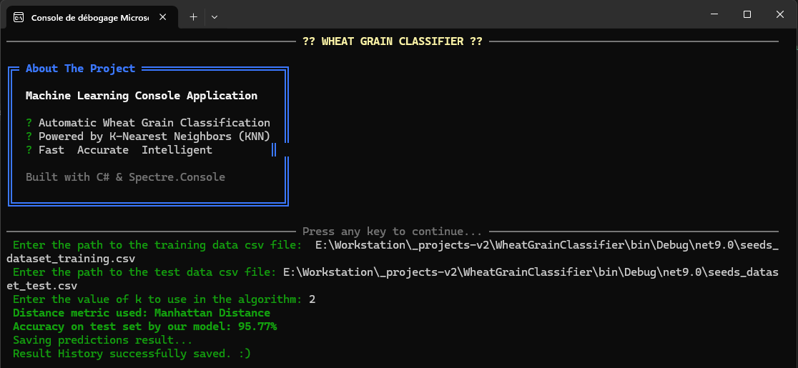
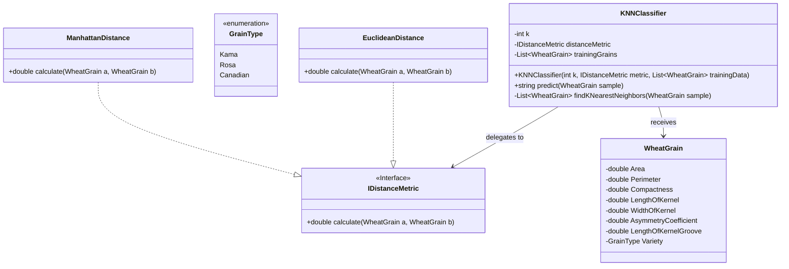
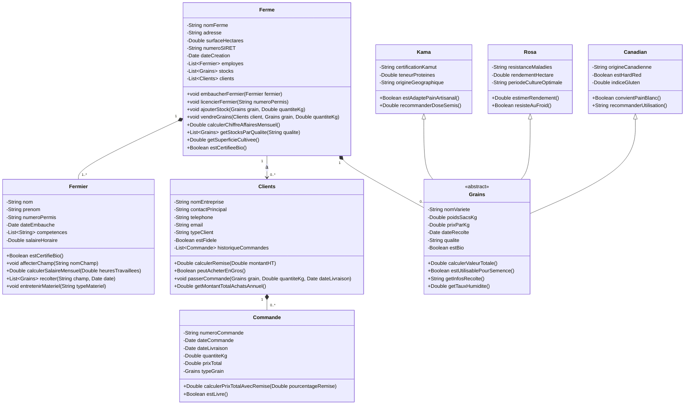

# Wheat Grain Classifier

A console application in C# that automatically classify wheat grains (variety : Kama, Rosa, Canadian) with the help of [K-Nearest Neighbor(KNN) Algorithm](https://en.wikipedia.org/wiki/K-nearest_neighbors_algorithm)



## Installation

### 1. Clone this repository

```bash
git clone https://github.com/Lil-Code30/WheatGrainClassifier.git

cd WheatGrainClassifier
```
### 2. Install the required Nuget Packages

```bash
Install-Package CsvHelper
Install-Package Newtonsoft.Json
Install-Package Spectre.Console

```
### 3. Files needed

The files needed to run this code are located in the folder `/data`

- **Test seeds data:** `seeds_dataset_test.csv`
- **Training seeds data:** `seeds_dataset_training.csv`

## How the program works

> The csv header : Variety;Area;Perimeter;Compactness;Kernel_Length;Kernel_Width;Asymmetry_Coefficient;Groove_Length
> Which is related to the `WheatGrain.cs` class

## Distance Metrics Used in KNN Algorithm
KNN uses distance metrics to identify nearest neighbor, these neighbors are used for classification and regression task. To identify nearest neighbor we use below distance metrics:

### 1. Euclidean Distance

Euclidean distance is defined as the straight-line distance between two points in a plane or space.  
You can think of it like the shortest path you would walk if you were to go directly from one point to another.

$$
\text{distance}(x, X_i) = \sqrt{\sum_{j=1}^{d} (x_j - X_{ij})^2}
$$

---

### 2. Manhattan Distance

This is the total distance you would travel if you could only move along horizontal and vertical lines like a grid or city streets.  
It’s also called **"taxicab distance"** because a taxi can only drive along the grid-like streets of a city.

$$
d(x, y) = \sum_{i=1}^{n} |x_i - y_i|
$$

> Source : [https://www.geeksforgeeks.org/machine-learning/k-nearest-neighbours/](https://www.geeksforgeeks.org/machine-learning/k-nearest-neighbours/)

## Modélisation UML pour la classification k-NN



## Farm Management System Architecture

> Note : This is not implemented in the code just for learning purpose


