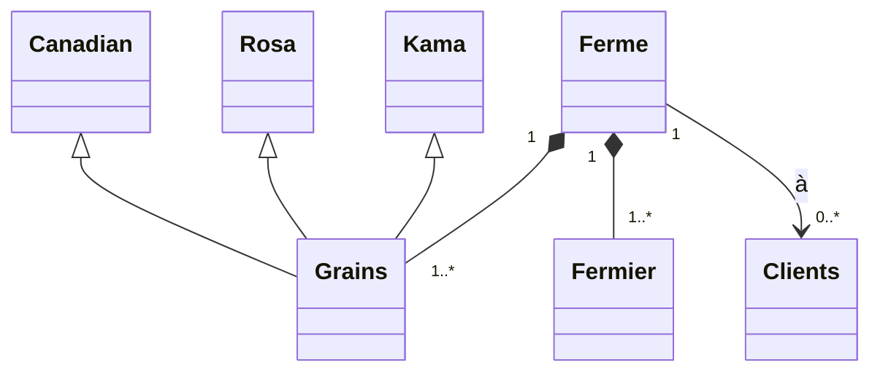

# Wheat Grain Classifier

Une application console en C# qui classe automatiquement des grains de blé (variétés Kama, Rosa et Canadian) à l'aide de l'algorithme k-plus proches voisins (k-NN).


## Installez les packages NuGet nécessaires 

```bash
Install-Package CsvHelper
Install-Package Newtonsoft.Json
Install-Package Spectre.Console

```

## Farm Management System Architecture

